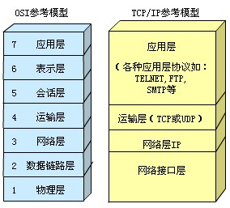
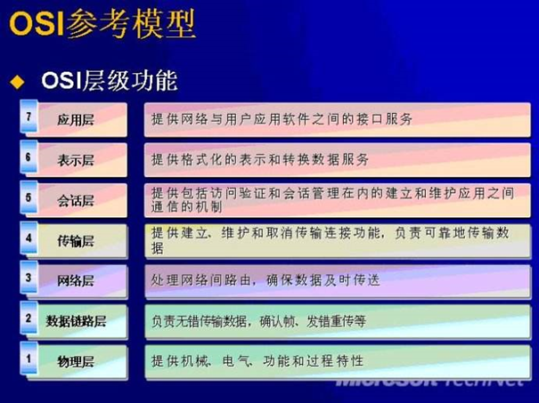
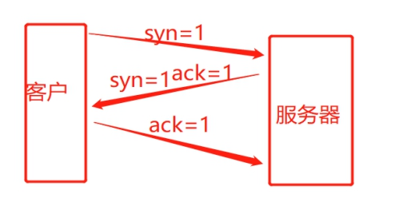
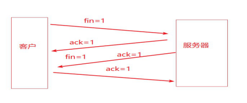

## OSI七层模型和TCP/IP四层模型
 

 

 
### OSI七层模型：OSI（Open System Interconnection）开放系统互连参考模型是国际标准化组织（ISO）制定的一个用于计算机或通信系统间互联的标准体系。
### TCP/IP四层模型：TCP/IP参考模型是计算机网络的祖父ARPANET和其后继的因特网使用的参考模型。
分层作用：方便管理

 

 

 
#### 七层模型优点：
1、把复杂的网络划分成为更容易管理的层（将整个庞大而复杂的问题划分为若干个容易处理的小问题）
2、没有一个厂家能完整的提供整套解决方案和所有的设备，协议.
3、独立完成各自该做的任务，互不影响，分工明确，上层不关心下层具体细节，分层同样有益于网络排错
功能与代表设备
##### 分层 名字 功能 工作在该层的设备
7 应用层 提供用户界面 QQ，IE 。应用程序
6 表示层 表示数据，进行加密等处理
5 会话层 将不同应用程序的数据分离
4 传输层 提供可靠或不可靠的传输，在重传前执行纠错 防火墙
3 网络层 提供逻辑地址，路由器使用它们来选择路径 三层交换机、路由器
2 数据链路层 将分组拆分为字节，并讲字节组合成帧，使用MAC地址提供介质访问，执行错误检测，但不纠错 二层交换机，网卡
1 物理层 在设备之间传输比特，指定电平，电缆速度和电缆针脚 集线器
   
###### 互动：为什么现代网络通信过程中用TCP/IP四层模型，而不是用OSI七层模型呢？
OSI七层模型是理论模型，一般用于理论研究，他的分层有些冗余，实际应用，选择TCP/IP的四层模型。而且 OSI 自身也有缺陷，大多数人都认为 OSI 模型的层次数量与内容可能是最佳的选择，其实并非如此，其中会话层和表示层几乎是空的，而数据链路层和网络层包含内容太多，有很多的子层插入，每个子层都有不同的功能。
 
常见网络相关的协议
 
DNS：域名解析协议 www.baidu.com
SNMP(Simple Network Management Protocol)网络管理协议
DHCP(Dynamic Host Configuration Protocol)动态主机配置协议，它是在TCP/IP网络上使客户机获得配置信息的协议
FTP(File Transfer Protocol)文件传输协议，它是一个标准协议，是在计算机和网络之间交换文件的最简单的方法。
TFTP(Trivial File Transfer Protocol)：小文件传输协议
HTTP(Hypertext Transfer Protocol )：超文本传输协议
HTTPS(Secure Hypertext Transfer Protocol)：安全超文本传输协议，它是由Netscape开发并内置于其浏览器中，用于对数据进行压缩和解压操作.
ICMP(Internet Control Message Protocol)：Internet控制信息协议,互联网控制报文协议
ping  ip定义消息类型有：TTL超时、地址的请求与应答、信息的请求与应答、目的地不可到达
SMTP(Simple Mail Transfer Protocol)：简单邮件传送协议
TELNET Protocol：虚拟终端协议
UDP(User Datagram Protocol)：用户数据报协议，它是定义用来在互连网络环境中提供包交换的计算机通信的协议
TCP（Transmission Control Protocol）：传输控制协议，是一种面向连接的、可靠的、基于字节流的传输层通信协议  log转发：开启一个协议：tcp(三次握手和四次挥手) 
 
###### TCP协议和UDP协议的区别
（1）TCP协议：TCP（Transmission Control Protocol，传输控制协议）是面向连接的协议，在收发数据前，必须和对方建立可靠的连接。
（2）UDP协议：UDP 是User Datagram Protocol的简称， 中文名是用户数据报协议，是一种无连接的传输层协议，提供面向事务的简单不可靠信息传送服务
######总结：TCP与UDP的区别：
1.基于连接与无连接；
2.对系统资源的要求（TCP较多，UDP少）；
3.UDP程序结构较简单；UDP信息包的标题很短，只有8个字节，相对于TCP的20个字节信息包的额外开销很小。所以传输速度可更快
4.TCP保证数据正确性，UDP可能丢包；TCP保证数据顺序，UDP不保证。
场景：视频，语音通讯使用udp，或网络环境很好，比如局域网中通讯可以使用udp。  udp数据传输完整性，可以通过应用层的软件来校对就可以了。
tcp传文件，数据完整性要求高。
 
TCP和UDP 常用端口号名称
 
（1）TCP 端口分配
21 ftp 文件传输服务
22 ssh 安全远程连接服务
23 telnet 远程连接服务
25 smtp 电子邮件服务
53 DNS 域名解析服务，有tcp53也有用udp53端口传输
80 http web服务
443 https 安全web服务
 
互动：如果你不知道哪个端口对应哪个服务怎么办？如873端口是哪个服务的？
[root@ken~]#  vim /etc/services    #此文件中,包含所有常见端口号及服务名称
 
##### linux网络相关的调试命令
 
一、桥接模式：配置桥接模式的虚拟机作为独立计算机存在
 
1. 虚拟机可以上外网
2. 可以和局域网内任意一台电脑通信
3. 可以和宿主机通信
4. 局域网内任意一台主机都可以和此虚拟机通信
 
##### 二、nat模式：配置nat模式的虚拟机使用本机IP地址（地址转化）

1. 物理机vmnet8这个网卡必须开启
2. 可以上外网
3. 可以宿主机通信
4. 局域网内不可以访问此虚拟机

##### 三、仅主机模式

1. 可以和宿主机通信
2. 同一台宿主机上的仅主机模式下的虚拟机之间可以互相通信
3. 不可以上外网
4. 局域网内不可以相互访问

1.修改IP相关信息

[root@ken ~]# ip a
1: lo: <LOOPBACK,UP,LOWER_UP> mtu 65536 qdisc noqueue state UNKNOWN group default qlen 1000
link/loopback 00:00:00:00:00:00 brd 00:00:00:00:00:00
inet 127.0.0.1/8 scope host lo
valid_lft forever preferred_lft forever
inet6 ::1/128 scope host
valid_lft forever preferred_lft forever
2: eth0: <BROADCAST,MULTICAST,UP,LOWER_UP> mtu 1500 qdisc pfifo_fast state UP group default qlen 1000
link/ether 00:0c:29:13:a1:49 brd ff:ff:ff:ff:ff:ff
inet 192.168.4.190/24 brd 192.168.4.255 scope global noprefixroute eth0
valid_lft forever preferred_lft forever
inet6 fe80::20c:29ff:fe13:a149/64 scope link
valid_lft forever preferred_lft forever

 
2. 修改网卡信息
修改配置文件 /etc/sysconfig/network-scripts/ifcfg-eth0

DEVICE=eth0 #指出设备名称
NM_CONTROLLED=yes #network mamager的参数，实时生效，不需要重启
ONBOOT=yes #设置为yes，开机自动启用网络连接
IPADDR=192.168.21.129 #IP地址
BOOTPROTO=none #设置为none禁止DHCP，设置为static启用静态IP地址，设置为dhcp开启DHCP服务
NETMASK=255.255.255.0 #子网掩码
DNS1=8.8.8.8 #第一个dns服务器
TYPE=Ethernet #网络类型为：Ethernet
GATEWAY=192.168.21.2 #设置网关
DNS2=114.114.114.114#第二个dns服务器
IPV6INIT=no #禁止IPV6
USERCTL=no #是否允许非root用户控制该设备，设置为no，只能用root用户更改
HWADDR=00:0C:29:2C:E1:0F #网卡的Mac地址
PREFIX=24
NAME="System eth0" #定义设备名称

 
3.临时添加IP地址

[root@ken ~]# ip a a 192.168.4.191 dev eth0
[root@ken ~]# ip a
1: lo: <LOOPBACK,UP,LOWER_UP> mtu 65536 qdisc noqueue state UNKNOWN group default qlen 1000
link/loopback 00:00:00:00:00:00 brd 00:00:00:00:00:00
inet 127.0.0.1/8 scope host lo
valid_lft forever preferred_lft forever
inet6 ::1/128 scope host
valid_lft forever preferred_lft forever
2: eth0: <BROADCAST,MULTICAST,UP,LOWER_UP> mtu 1500 qdisc pfifo_fast state UP group default qlen 1000
link/ether 00:0c:29:13:a1:49 brd ff:ff:ff:ff:ff:ff
inet 192.168.4.190/24 brd 192.168.4.255 scope global noprefixroute eth0
valid_lft forever preferred_lft forever
inet 192.168.4.191/32 scope global eth0
valid_lft forever preferred_lft forever
inet6 fe80::20c:29ff:fe13:a149/64 scope link
valid_lft forever preferred_lft forever

 
4.查看端口监听状态
ss 命令
常用选项：
-t: 显示tcp链接
-n: 以数字形式显示当前链接的端口
-l: 只显示监听的
-a：显示全部
-p: 显示PID
常用组合：ss -tnl
 
[root@ken ~]# ss -tnl
State Recv-Q Send-Q Local Address:Port Peer Address:Port
LISTEN 0 128 *:22 *:*
LISTEN 0 100 127.0.0.1:25 *:*
LISTEN 0 128 :::22 :::*
LISTEN 0 100 ::1:25 :::*
 
 #####进程管理
 
程序：二进制文件，静态 /bin/date,/usr/sbin/sshd 
进程：是程序运行的过程，动态，有生命周期及运行状态。
 
下图所示的是进程的生命周期：

 
 
描述如下：
父进程复制自己的地址空间（fork  [fɔ:k] 分叉）创建一个新的（子）进程结构。每个新进程分配一个唯一的进程 ID （PID），满足跟踪安全性之需。PID 和父进程 ID （PPID）是子进程环境的元素，任何进程都可以创建子进程，所有进程都是第一个系统进程的后代。
centos5或6PID为1的进程是： init  
centos7 PID为1的进程是：     systemd
僵尸进程：一个进程使用fork创建子进程，如果子进程退出，而父进程并没有调用wait或waitpid获取子进程的状态信息，那么子进程的进程描述符仍然保存在系统中。这种进程称之为僵尸进程。
用自己的话表达:父进程退出了，子进程没有退出，那么这些子进程就没有父进程来管理了，就变成僵尸进程。
 
进程的属性
 
进程ID（PID)：是唯一的数值，用来区分进程
进程状态：状态分为运行R、休眠S、僵尸Z
 
##### 使用ps查看进程工具
 
1、ps查看进程工具
例1：常用的参数：
a: 显示跟当前终端关联的所有进程
u: 基于用户的格式显示（U: 显示某用户ID所有的进程）
x: 显示所有进程，不以终端机来区分
 

[root@ken ~]# ps aux
USER PID %CPU %MEM VSZ RSS TTY STAT START TIME COMMAND
root 1 0.0 0.3 125328 3832 ? Ss 20:40 0:01 /usr/lib/syst
root 2 0.0 0.0 0 0 ? S 20:40 0:00 [kthreadd]
root 3 0.0 0.0 0 0 ? S 20:40 0:00 [ksoftirqd/0]
root 5 0.0 0.0 0 0 ? S< 20:40 0:00 [kworker/0:0H
root 6 0.0 0.0 0 0 ? S 20:40 0:00 [kworker/u256
root 7 0.0 0.0 0 0 ? S 20:40 0:00 [migration/0]
root 8 0.0 0.0 0 0 ? S 20:40 0:00 [rcu_bh]
root 9 0.0 0.0 0 0 ? R 20:40 0:00 [rcu_sched]
root 10 0.0 0.0 0 0 ? S< 20:40 0:00 [lru-add-drai
root 11 0.0 0.0 0 0 ? S 20:40 0:00 [watchdog/0]

注：最后一列[xxxx] 使用方括号括起来的进程是内核态的进程。没有括起来的是用户态进程。
上面的参数输出每列含意：
USER: 启动这些进程的用户
PID: 进程的ID
%CPU 进程占用的CPU百分比； 
%MEM 占用内存的百分比； 
VSZ：进程占用的虚拟内存大小（单位：KB） 
RSS：进程占用的物理内存大小（单位：KB） 
STAT：该程序目前的状态，Linux进程有5种基本状态：
     R ：该程序目前正在运作，或者是可被运作；
     S ：该程序目前正在睡眠当中，但可被某些讯号(signal) 唤醒。
     T ：该程序目前正在侦测或者是停止了；
     Z ：该程序应该已经终止，但是其父程序却无法正常的终止他，造成 zombie (疆尸) 程序的状态
     D  不可中断状态.  
5个基本状态后，还可以加一些字母，比如：Ss、R+，如下图：
 

 
它们含意如下:：
<: 表示进程运行在高优先级上
N: 表示进程运行在低优先级上
L: 表示进程有页面锁定在内存中
s: 表示进程是控制进程
l: 表示进程是多线程的
+: 表示当前进程运行在前台
START：该 process 被触发启动的时间；
TIME ：该 process 实际使用 CPU 运作的时间。
COMMAND：该程序的实际指令
 
uptime查看系统负载
 
[root@ken ~]# uptime
22:14:16 up 1:33, 2 users, load average: 0.00, 0.01, 0.04
 
弹出消息含意如下：
当前时间 系统运行时间 当前登录用户 系统负载1分钟，5分钟，15分钟的平均负载
 
那么什么是系统平均负载呢？ 系统平均负载是指在特定时间间隔内运行队列中的平均进程数。
如果每个CPU内核的当前活动进程数不大于3的话，那么系统的性能是良好的。如果每个CPU内核的任务数大于5，那么这台机器的性能有严重问题。
如果你的linux主机是1个双核CPU的话，当Load Average 为6的时候说明机器已经被充分使用了。
 
 
##### top命令
 

[root@ken ~]# top
top - 22:19:03 up 1:38, 2 users, load average: 0.07, 0.03, 0.04
Tasks: 95 total, 1 running, 94 sleeping, 0 stopped, 0 zombie
%Cpu(s): 0.0 us, 0.0 sy, 0.0 ni,100.0 id, 0.0 wa, 0.0 hi, 0.0 si, 0.0 s
KiB Mem : 997956 total, 769528 free, 91376 used, 137052 buff/cache
KiB Swap: 2097148 total, 2097148 free, 0 used. 750772 avail Mem
PID USER PR NI VIRT RES SHR S %CPU %MEM TIME+ COMMAND
638 root 20 0 298712 6120 4788 S 0.7 0.6 0:06.92 vmtoolsd
646 root 20 0 476188 8996 6748 S 0.7 0.9 0:00.30 NetworkMa+
1 root 20 0 125328 3832 2576 S 0.0 0.4 0:01.30 systemd
2 root 20 0 0 0 0 S 0.0 0.0 0:00.00 kthreadd
3 root 20 0 0 0 0 S 0.0 0.0 0:00.14 ksoftirqd+
5 root 0 -20 0 0 0 S 0.0 0.0 0:00.00 kworker/0+
6 root 20 0 0 0 0 S 0.0 0.0 0:00.14 kworker/u+
7 root rt 0 0 0 0 S 0.0 0.0 0:00.00 migration+
8 root 20 0 0 0 0 S 0.0 0.0 0:00.00 rcu_bh
9 root 20 0 0 0 0 S 0.0 0.0 0:00.40 rcu_sched

 
第1行：系统时间、运行时间、登录终端数、系统负载（三个数值分别为1分钟、5分钟、15分钟内的平均值，数值越小意味着负载越低）。
第2行：进程总数、运行中的进程数、睡眠中的进程数、停止的进程数、僵死的进程数。
第3行：用户占用资源百分比、系统内核占用资源百分比、改变过优先级的进程资源百分比、空闲的资源百分比等。其中数据均为CPU数据并以百分比格式显示，例如“97.1 id”意味着有97.1%的CPU处理器资源处于空闲。
第4行：物理内存总量、内存使用量、内存空闲量、作为内核缓存的内存量。
第5行：虚拟内存总量、虚拟内存使用量、虚拟内存空闲量、已被提前加载的内存量。
第6行: 
PID — 进程id
USER — 进程所有者
PR — 进程优先级
NI — nice值。负值表示高优先级，正值表示低优先级
VIRT — 进程使用的虚拟内存总量，单位kb。VIRT=SWAP+RES
RES — 进程使用的、未被换出的物理内存大小，单位kb。RES=CODE+DATA
SHR — 共享内存大小，单位kb
S — 进程状态。D=不可中断的睡眠状态 R=运行 S=睡眠 T=跟踪/停止 Z=僵尸进程
%CPU — 上次更新到现在的CPU时间占用百分比
%MEM — 进程使用的物理内存百分比
TIME+ — 进程使用的CPU时间总计，单位1/100秒
COMMAND — 进程名称（命令名/命令行）
 
##### lsof命令
 
lsof命令用于查看你进程打开的文件，打开文件的进程，进程打开的端口(TCP、UDP)
-i<条件>：列出符合条件的进程。（4、6、协议、:端口、 @ip ）
[root@ken ~]# lsof -i :22
COMMAND PID USER FD TYPE DEVICE SIZE/OFF NODE NAME
sshd 867 root 3u IPv4 19361 0t0 TCP *:ssh (LISTEN)
sshd 867 root 4u IPv6 19370 0t0 TCP *:ssh (LISTEN)

##### 三次握手和四次挥手
三次握手
客户端–》服务器端
客户端发送syn=1请求包给服务器端，服务器端接收请求之后给返回一个syn=1,ack=1的返回包，客户端收到之后就会给服务器端返回一个ack=1的包，这个时候连接建立，开始传输文件。

 

##### 四次挥手
客户端发送fin=1的包给服务器端，服务器端收到fin=1的包后返回ack=1的包给客户端服务器端发送fin=1，Ack=1的包给客户端，客户端收到再返ac的包，这个时候连接断掉。

 

#####TCP UDP
连接 无连接
TCP较多使用 UDP使用少
TCP保证数据正确性，TCP保证数据顺序， UDP程序结构较简单；UDP信息包的标题很短，传输速度可更快;不安全
传输慢；安全
（1）TCP协议：TCP（Transmission Control Protocol，传输控制协议）是面向连接的协议，在收发数据前，必须和对方建立可靠的连接。
（2）UDP协议：UDP 是User Datagram Protocol的简称， 中文名是用户数据报协议，是一种无连接的传输层协议，提供面向事务的简单不可靠信息传送服务
总结：TCP与UDP的区别：
